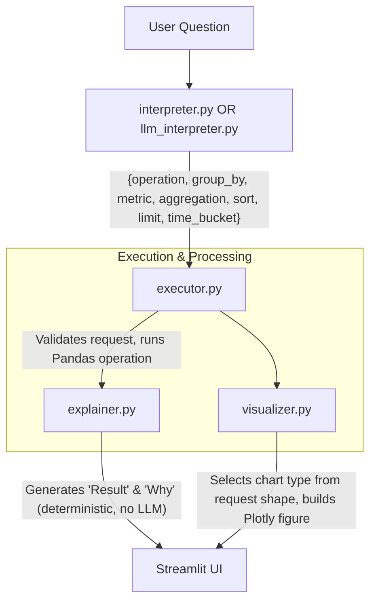

# InsightBoard

**Ask questions about your CSV in plain English.**


[](https://python.org)
[](https://streamlit.io)
[](https://pandas.pydata.org)
[](https://plotly.com)
[](https://aistudio.google.com)

[](LICENSE)
[](#architecture)
[](#design-decisions)

InsightBoard is a natural-language data analysis tool. Upload a CSV, ask a question, and get back a real answer — computed with pandas, not hallucinated by an LLM.

---

## Screenshots

<p align="center">
  
  
</p>
<p align="center">
  
  
</p>

---

## What it does

- **Upload any CSV** and get an automatic dataset overview: shape, column types, missing-value summary, numeric statistics, and a preview
- **Ask questions in plain English** — *"Which region had the highest average revenue?"*, *"Show revenue by month"*, *"Top 5 products by sales"*
- **Every answer includes four things**: a natural-language result, the underlying calculation, a chart when appropriate, and a short "why" explaining how it was computed
- **Schema-aware interpretation** — the app profiles each column (numeric / categorical / datetime / id / text) so it can reason about what's actually answerable
- **Automatic chart selection** — bar, horizontal bar, or line chart chosen from the shape of the request, not hardcoded per question
- **Exports** — download any result as CSV, the schema profile as JSON
- **Two interpreters** — a deterministic rule-based one that always works, and an optional LLM one (Google Gemini) for flexible phrasing

---

## Architecture

The core design principle: **the LLM never executes code.**

It only produces a structured JSON request describing the intended analysis. Python validates that request, then runs it with pandas.



### Design decisions

- **The LLM never executes code.** It returns JSON describing *what to compute*. Python does the computing. This eliminates the entire class of "prompt injection → arbitrary code execution" bugs you see in LLM data tools that pipe model output into `eval()` or `exec()`.
- **Deterministic by default.** The rule-based interpreter works with zero external dependencies. The app never breaks because an API is down — you just toggle the LLM off.
- **Explanation layer is downstream of execution.** Every sentence the app generates is derived from the actual pandas result plus the structured request. It never sees the raw question. This means it cannot hallucinate a claim the data doesn't support.
- **Two interpreters, one interface.** `interpret(question, df)` is the contract. Swapping the rule-based interpreter for the LLM interpreter is one line in `app.py`, and nothing downstream changes.
- **Schema profiling is a separate concern.** `schema.profile(df)` classifies each column, and both the interpreter and the visualizer read that output instead of guessing from dtypes. It's testable in isolation and reusable.

---

## Tech stack

| Layer | Choice |
|---|---|
| UI | Streamlit |
| Data | pandas, NumPy |
| Charts | Plotly Express |
| LLM | Google Gemini (`gemini-flash-latest`) |
| Language | Python 3.11+ |
| Version control | Git / GitHub |

---

## Run locally

```bash
git clone https://github.com/annavailablee/insightboard.git
cd insightboard

python -m venv .venv
source .venv/bin/activate           # Windows: .venv\Scripts\Activate.ps1

pip install -r requirements.txt
streamlit run app.py